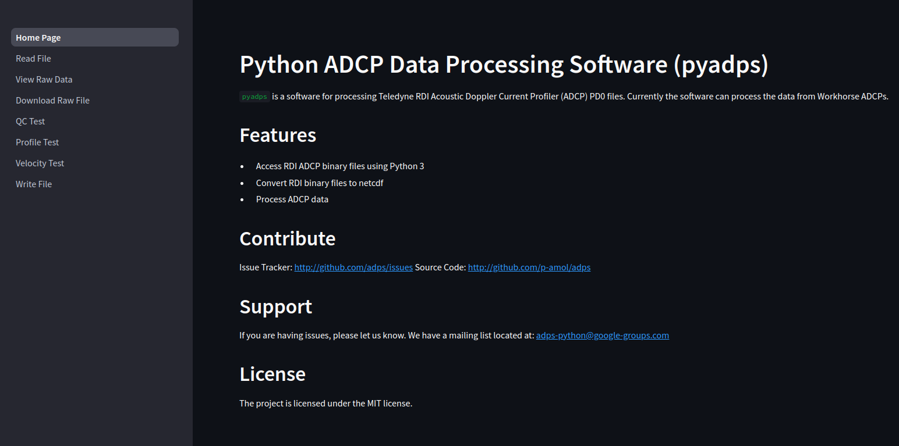

Interactive interface
=====================

ADCP data can be processed using a web interface developed using `Streamlit`. 
To access the interface, run the following command in your terminal 
after activating your `pyadps` environment (Python or Conda):

.. code:: bash

   run-pyadps

This will open a web page in your default browser.

Click the `ReadFile` button in the left-side panel 
to upload your file. Follow the steps outlined in 
the left panel menu sequentially to process the data.

For processing a new dataset, restart the browser using the 
`run-pyadps` command. This ensures no residual data from 
the previous file remains in the web cache.

